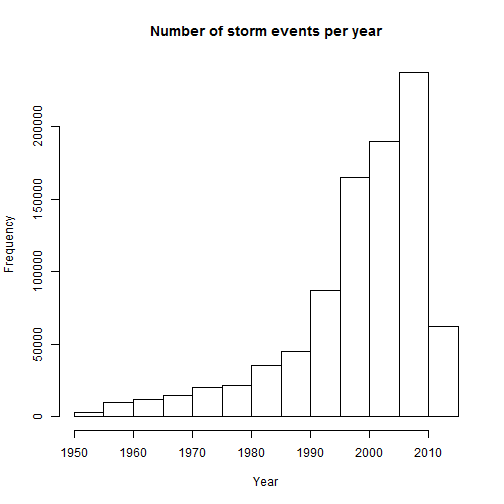
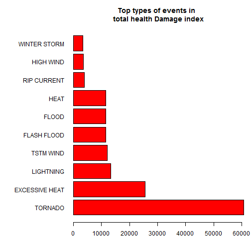
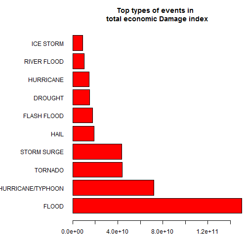

# Reproducible Research Assignment 2
========================================================

### by *Thomas Antonakis* on Sun Sep 14 13:33:54 2014

## Effects of Storm events on population health and economic damage


## Synopsis

Immediately after the title, there should be a synopsis which describes and summarizes your analysis in at most 10 complete sentences.

## Data Processing

There should be a section titled Data Processing which describes (in words and code) how the data were loaded into R and processed for analysis. In particular, your analysis must start from the raw CSV file containing the data. You cannot do any preprocessing outside the document. If preprocessing is time-consuming you may consider using the cache = TRUE option for certain code chunks.

This project involves exploring the U.S. National Oceanic and Atmospheric Administration's (NOAA) storm database. THis database tracks characteristics of major storms and weather events in the United States, including when and where they occur, as well as estimates of any fatalities, injuries, property and crop damage. 

The events in the database start in the year 1950 and end in November 2011. In the earlier years of the database there are generally fewer events recorded, most likely due to lack of good records. More recent years should be considered more complete. 

The data for the  analysis came in form of a comma-separated-value file compressed via the bzip2 algorithm to reduce its size.  
Let's first of all download the file.  


```r
# Create folder to put download the file
if(!file.exists("./data")){dir.create("./data")}

# Download the file, and keep the date. 
if(!file.exists("./data/storm_data.csv.bz2")){
fileurl<-"https://d396qusza40orc.cloudfront.net/repdata%2Fdata%2FStormData.csv.bz2"
download.file(fileurl, destfile="./data/storm_data.csv.bz2", method="auto")
dateDownloaded<-date()
}
```

The file is now downloaded to a local folder. We now will unzip it and load it into a dataset in the R environment.  

*Loading the whole dataset in R, caused knitr to stop its executionand not showing anything from this point down in the report. The loading was done in R studio , some exploration was performed and below we will only load / read the variables that seem to be related with the questions of the assignment.*  


```r
# "Unzip file" to a variable
filename <- bzfile("./data/storm_data.csv.bz2")

# Load file in a dataframe. 
# We do not need all variables. After checking the documentation we keep the following
if (!exists("storm")){
storm<-read.csv(filename, stringsAsFactors = FALSE, 
                colClasses=c("NULL", NA   ,"NULL","NULL","NULL",
                             "NULL","NULL", NA   ,"NULL","NULL",
                             "NULL","NULL","NULL","NULL","NULL",
                             "NULL","NULL","NULL","NULL","NULL",
                             "NULL","NULL",NA,NA,NA,
                             NA,NA,NA,"NULL","NULL",
                             "NULL","NULL","NULL","NULL","NULL",
                             "NULL","NULL"))
}
```

This may take a couple of minutes depending on the sustem, as the csv is 47Mb big compressed and uncompressed is much much more than that: 548Mb.  
So, hopefully, after the csv has been loaded in a dataframe named `storm` , we can check it out a little bit.


```r
# Check the file out
dim(storm)
```

```
## [1] 902297      8
```

```r
str(storm)
```

```
## 'data.frame':	902297 obs. of  8 variables:
##  $ BGN_DATE  : chr  "4/18/1950 0:00:00" "4/18/1950 0:00:00" "2/20/1951 0:00:00" "6/8/1951 0:00:00" ...
##  $ EVTYPE    : chr  "TORNADO" "TORNADO" "TORNADO" "TORNADO" ...
##  $ FATALITIES: num  0 0 0 0 0 0 0 0 1 0 ...
##  $ INJURIES  : num  15 0 2 2 2 6 1 0 14 0 ...
##  $ PROPDMG   : num  25 2.5 25 2.5 2.5 2.5 2.5 2.5 25 25 ...
##  $ PROPDMGEXP: chr  "K" "K" "K" "K" ...
##  $ CROPDMG   : num  0 0 0 0 0 0 0 0 0 0 ...
##  $ CROPDMGEXP: chr  "" "" "" "" ...
```

```r
summary(storm)
```

```
##    BGN_DATE            EVTYPE            FATALITIES     INJURIES     
##  Length:902297      Length:902297      Min.   :  0   Min.   :   0.0  
##  Class :character   Class :character   1st Qu.:  0   1st Qu.:   0.0  
##  Mode  :character   Mode  :character   Median :  0   Median :   0.0  
##                                        Mean   :  0   Mean   :   0.2  
##                                        3rd Qu.:  0   3rd Qu.:   0.0  
##                                        Max.   :583   Max.   :1700.0  
##     PROPDMG      PROPDMGEXP           CROPDMG       CROPDMGEXP       
##  Min.   :   0   Length:902297      Min.   :  0.0   Length:902297     
##  1st Qu.:   0   Class :character   1st Qu.:  0.0   Class :character  
##  Median :   0   Mode  :character   Median :  0.0   Mode  :character  
##  Mean   :  12                      Mean   :  1.5                     
##  3rd Qu.:   0                      3rd Qu.:  0.0                     
##  Max.   :5000                      Max.   :990.0
```

The initial dataframe contains 902297 observations and 8 variables which are explained below:  

1. BGN_DATE is for now a character variable which contains the date of the record.  
2. EVTYPE is a character variable which contains the type of event.  
3. FATALITIES is a numeric vector containing the number of deaths caused by a specific observation.  
4. INJURIESis a numeric vector containing the number of injured persons caused by a specific observation.  
5. PROPDMG is a numeric vector containing an estimate from the researcher of the economic damage caused by a specific observation in units (see next variable) on prroperties.  
6. PROPDMGEXP is a character variable which should contain a letter, ideally one of the following "H","K","M","B". These letters should stand for Hundreds, Thousands, Millions, and Billions.  
7. CROPDMG is a numeric vector containing an estimate from the researcher of the economic damage caused by a specific observation in units (see next variable) on crops.
8. CROPDMGEXP is a character variable which should contain a letter, ideally one of the following "H","K","M","B". These letters should stand for Hundreds, Thousands, Millions, and Billions.  

We will transform the BGN_DATE variable to the year of the record. Knowing that the records span from 1950 to 2011 which is a very long period of time, days, months do not really matter.


```r
# Fix dates Convert date and time to YEAR
storm$BGN_DATE <- as.numeric(format(as.Date(storm$BGN_DATE, format = "%m/%d/%Y %H:%M:%S"), "%Y"))
```

We will calculate the quantiles of the distribution of the years below.

```r
quantile(storm$BGN_DATE, c(seq(from=0.1, to=1, by = 0.1)))
```

```
##  10%  20%  30%  40%  50%  60%  70%  80%  90% 100% 
## 1982 1992 1996 1999 2002 2004 2006 2008 2010 2011
```

Let's make a histogram of the number of observations per year.

```r
# Histogram the years for the count of records 
hist(storm$BGN_DATE, main = "Number of storm events per year", 
     xlab = "Year")
```

 

In the earlier years of the database there are generally fewer events recorded, most likely due to lack of good records. More recent years should be considered more complete.  We will take out of the analysis records who date earlier than 1980.  

The proportion of observations before 1980 are the 8.35% of total observations, and will nw be dropped out.  


```r
# Decide which years to keep
storm<-storm[storm$BGN_DATE>=1980,]
```

Having now made up our minds about the years we will use, we will create an intermediate file that will be used from now on for the anaysis. The old dataframe will be deleted for memory reasons.


```r
# We do not need all variables. After checking the documentation we keep the following
file_intermediate<-data.frame("EVTYPE" = storm$EVTYPE, "FATALITIES" = storm$FATALITIES,
                              "INJURIES" = storm$INJURIES, "PROPDMG" = storm$PROPDMG, 
                              "PROPDMGEXP" = storm$PROPDMGEXP, "CROPDMG" = storm$CROPDMG, 
                              "CROPDMGEXP" = storm$CROPDMGEXP)

# Release memory
rm(storm)
```

Let us take another look at the summary and structure of the intermediate file:


```r
# Check the intermediate file out
str(file_intermediate)
```

```
## 'data.frame':	826931 obs. of  7 variables:
##  $ EVTYPE    : Factor w/ 985 levels "   HIGH SURF ADVISORY",..: 244 244 244 244 244 244 856 856 856 834 ...
##  $ FATALITIES: num  0 0 0 0 0 0 0 0 0 0 ...
##  $ INJURIES  : num  0 0 0 0 0 0 0 0 0 0 ...
##  $ PROPDMG   : num  0 0 0 0 0 0 0 0 0 2.5 ...
##  $ PROPDMGEXP: Factor w/ 19 levels "","-","?","+",..: 1 1 1 1 1 1 1 1 1 17 ...
##  $ CROPDMG   : num  0 0 0 0 0 0 0 0 0 0 ...
##  $ CROPDMGEXP: Factor w/ 9 levels "","?","0","2",..: 1 1 1 1 1 1 1 1 1 1 ...
```

```r
summary(file_intermediate)
```

```
##                EVTYPE         FATALITIES     INJURIES         PROPDMG    
##  HAIL             :267518   Min.   :  0   Min.   :   0.0   Min.   :   0  
##  TSTM WIND        :187596   1st Qu.:  0   1st Qu.:   0.0   1st Qu.:   0  
##  THUNDERSTORM WIND: 82563   Median :  0   Median :   0.0   Median :   0  
##  FLASH FLOOD      : 54277   Mean   :  0   Mean   :   0.1   Mean   :  12  
##  TORNADO          : 38773   3rd Qu.:  0   3rd Qu.:   0.0   3rd Qu.:   1  
##  FLOOD            : 25326   Max.   :583   Max.   :1568.0   Max.   :5000  
##  (Other)          :170878                                                
##    PROPDMGEXP        CROPDMG        CROPDMGEXP    
##         :412447   Min.   :  0.0          :543047  
##  K      :404025   1st Qu.:  0.0   K      :281832  
##  M      : 10091   Median :  0.0   M      :  1994  
##  0      :   216   Mean   :  1.7   k      :    21  
##  B      :    40   3rd Qu.:  0.0   0      :    19  
##  5      :    28   Max.   :990.0   B      :     9  
##  (Other):    84                   (Other):     9
```

## Results

There should be a section titled Results in which your results are presented.

The analysis document must have at least one figure containing a plot.

Your analyis must have no more than three figures. Figures may have multiple plots in them (i.e. panel plots), but there cannot be more than three figures total.

We will first tackle the analysis on health effects of the storms. So, we will check the sums of the injuries and the fatalities of storms recorded after 1980.  


```r
#Check the variables connected to population health effects
sum(file_intermediate$FATALITIES)
```

```
## [1] 11786
```

```r
sum(file_intermediate$INJURIES)
```

```
## [1] 87153
```

There have been 11786 deaths and 87153  injuries from storm events from 1980 onwards.   

Let us take a subset of the intermediate file using only the event types and the variables of injuries and fatalities.


```r
# Store health related variables to a separate dataframe.
health<-data.frame("EVTYPE" = file_intermediate$EVTYPE, 
                   "FATALITIES" = file_intermediate$FATALITIES,
                   "INJURIES" = file_intermediate$INJURIES)

# "Clean" data frame names
names(health)<-tolower(names(health))
```

We need to discuss a bit the comparison of an injury and a fatality on the effect they have on population health. We can all understand that  a minor scratch might be recorded as an injury, as a paralysis can also be cosidered as an injury too, but a fatality means a lot more than that, but it is more specific.  
In order to point that difference out we will multiply the effect of a fatality so that a fatality is considered 10 times more harmful as an innjury record, and we could even be quite underestimating the comparison.  
So an index of health effect will be created in order to combine the fatalities and the injuries data. 


```r
# Calculate a health damage index using the fatalities and injuries variables
# We assume that one fatality weighs as much as 10 injuries in terms of health damage
health$damage <- health$injuries + 10 * health$fatalities
```

We now have to aggregate the effect on the event types, so as to find out which types are the more harmful for the population health, across the United States.

We will simply add all the figures in the index to see the total damage caused, and simultaneously, we will try the same things but with averages, so as to calculate an effect per event.


```r
# Calculate sum of damages and average damage per evtype
library(plyr)
health_sum<-ddply(.data=health, .variables=.(evtype) , summarize, sum = sum(damage))
health_ave<-ddply(.data=health, .variables=.(evtype) , summarize, sum = mean(damage))
names(health_sum) [2]<- c("sum_damage")
names(health_ave) [2]<- c("avg_damage")
health_agg<-arrange(join(health_sum, health_ave), evtype)
```

```
## Joining by: evtype
```

```r
a<-head(arrange(health_agg, sum_damage, decreasing = TRUE), 10)
a
```

```
##            evtype sum_damage avg_damage
## 1         TORNADO      60711    1.56581
## 2  EXCESSIVE HEAT      25555   15.22944
## 3       LIGHTNING      13390    0.84994
## 4       TSTM WIND      11997    0.06395
## 5     FLASH FLOOD      11557    0.21293
## 6           FLOOD      11489    0.45364
## 7            HEAT      11470   14.95437
## 8     RIP CURRENT       3912    8.32340
## 9       HIGH WIND       3617    0.17895
## 10   WINTER STORM       3381    0.29572
```

```r
head(arrange(health_agg, avg_damage, decreasing = TRUE), 10)
```

```
##                        evtype sum_damage avg_damage
## 1  TORNADOES, TSTM WIND, HAIL        250     250.00
## 2               COLD AND SNOW        140     140.00
## 3       TROPICAL STORM GORDON        123     123.00
## 4                   Heat Wave         70      70.00
## 5       RECORD/EXCESSIVE HEAT        170      56.67
## 6           HEAT WAVE DROUGHT         55      55.00
## 7                EXTREME HEAT       1115      50.68
## 8          HIGH WIND AND SEAS         50      50.00
## 9                  WILD FIRES        180      45.00
## 10             HIGH WIND/SEAS         40      40.00
```

It turns out that the average version did not work as expected as the mean equals the sum , so these types of storm events have occured too few times.

So, using the total effect we show in the following plot which tyes of storms have had the greates effects on population health.  


```r
# Sum will be used
# Make a plot to illustrate greatest threats
aplot <- a$sum_damage
names(aplot) <- a$evtype
par(mar = c(4, 10, 4, 1))
barplot(aplot, col= 2, main="Top types of events in \n total health Damage index", 
        horiz=TRUE, las=1)
```

 

```r
# Release memory
rm(health_sum,health_ave)
```

The most harmful in terms of population health storm types are in decreasing order: TORNADO, EXCESSIVE HEAT, LIGHTNING, TSTM WIND, FLASH FLOOD, FLOOD


We will now tackle the analysis on the economic damage caused by storms. In out intermediate file there are four variables that are related to economic damage.

5. PROPDMG is a numeric vector containing an estimate from the researcher of the economic damage caused by a specific observation in units (see next variable) on prroperties.  
6. PROPDMGEXP is a character variable which should contain a letter, ideally one of the following "H","K","M","B". These letters should stand for Hundreds, Thousands, Millions, and Billions.  
7. CROPDMG is a numeric vector containing an estimate from the researcher of the economic damage caused by a specific observation in units (see next variable) on crops.
8. CROPDMGEXP is a character variable which should contain a letter, ideally one of the following "H","K","M","B". These letters should stand for Hundreds, Thousands, Millions, and Billions. 

So, actually there are two sectors that we can calculate economic damage: 

* Property damage
* Crops damage

The way we will calculate the damage in each sector is the following:  
We will multiply the actual number written down by the researcher (in variable `****DMG`) with a factor that will be created through the `****DMGEXP` variables. 


```r
# Explore the variables connected to monetary damages.
table(file_intermediate$PROPDMGEXP, useNA="ifany")
```

```
## 
##             -      ?      +      0      1      2      3      4      5 
## 412447      1      8      5    216     25     13      4      4     28 
##      6      7      8      B      h      H      K      m      M 
##      4      5      1     40      1      6 404025      7  10091
```

```r
table(file_intermediate$CROPDMGEXP, useNA="ifany")
```

```
## 
##             ?      0      2      B      k      K      m      M 
## 543047      7     19      1      9     21 281832      1   1994
```

```r
# Upper-case everything
file_intermediate$PROPDMGEXP<-toupper(file_intermediate$PROPDMGEXP)
file_intermediate$CROPDMGEXP<-toupper(file_intermediate$CROPDMGEXP)

# Assign everyhing that is not empty or "H", K", "M", "B" to Missing value
file_intermediate$PROPDMGEXP[!file_intermediate$PROPDMGEXP %in% 
                                     c("", "H", "K","M","B")]<-NA
file_intermediate$CROPDMGEXP[!file_intermediate$CROPDMGEXP %in% 
                                     c("", "H", "K","M","B")]<-NA
```

So, after a first cleanup, let us take a look at the new `****DMGEXP`s

```r
# Summarize new exponents
table(file_intermediate$PROPDMGEXP, useNA="ifany")
```

```
## 
##             B      H      K      M   <NA> 
## 412447     40      7 404025  10098    314
```

```r
table(file_intermediate$CROPDMGEXP, useNA="ifany")
```

```
## 
##             B      K      M   <NA> 
## 543047      9 281853   1995     27
```

We bring the new variables to a new clean dataset to be used for the economic analysis:


```r
# Store money related variables to a separate dataframe.
economic<-data.frame("EVTYPE" = file_intermediate$EVTYPE, 
                   "PROPDMG" = file_intermediate$PROPDMG, 
                   "PROPDMGEXP" = file_intermediate$PROPDMGEXP, 
                   "CROPDMG" = file_intermediate$CROPDMG, 
                   "CROPDMGEXP" = file_intermediate$CROPDMGEXP)

# "Clean" data frame names
names(economic)<-tolower(names(economic))

# Release memory
rm(file_intermediate)
```

Please note that we assigned anything that did not look like "H", "K","M","B" or an empty record to a missing values, and we plan to take those observations out. Before we do that we will calculate how many are to be taken out as a share of the total observations (after 1980)


```r
# Calculate share of missing values
good<- complete.cases(economic$propdmgexp,economic$cropdmgexp)
round(abs(sum(good)/nrow(economic)-1)*100, 2)
```

```
## [1] 0.04
```

The share of missing values is only 0.04% of the total, so we will indeed take them out.


```r
# Take Missing values out of economic dataframe
economic<-economic[good,]

# Release memory
rm(good)
```

As described in the above list, apart from other characters that we will deal with later, the `****DMGEXP` variables contain mostly the letters `H,T,M,B` , which stand for Hundreds, Thousands, Millions, and Billions.  So, a transformation need to be done so as to have the actual multiplier. 


```r
# Calculate an economic damage index using the given variables
# First the exponents must be transformed to multipliers
economic$propdmgexpm[economic$propdmgexp=="B"]<-9
economic$propdmgexpm[economic$propdmgexp=="M"]<-6
economic$propdmgexpm[economic$propdmgexp=="K"]<-3
economic$propdmgexpm[economic$propdmgexp=="H"]<-2
economic$propdmgexpm[economic$propdmgexp==""]<-0
economic$cropdmgexpm[economic$cropdmgexp=="B"]<-9
economic$cropdmgexpm[economic$cropdmgexp=="M"]<-6
economic$cropdmgexpm[economic$cropdmgexp=="K"]<-3
economic$cropdmgexpm[economic$cropdmgexp=="H"]<-2
economic$cropdmgexpm[economic$cropdmgexp==""]<-0
```

The values that have been assigned to each level of `****DMGEXP` is the power to which 10 must bee raised to so as to get the multiplier.  
e.g. K is transformed to 3 because 10^3 = 1,000 and K means Thousands.  
Now, assuming that each dollar of crop damage is equal to a dollar of property damage, we may create the `damage` variable in the `economic` dataset.


```r
# Suppose that property damage of one dollar weighs exactly as a crop damage of 
# one dollar in the economical damage, then the economic damage index is just 
# the sum of the crops and property product of exponents and dollar figures.

economic$damage <- (economic$propdmg * 10 ^economic$propdmgexpm )+ 
        (economic$cropdmg * 10 ^ economic$cropdmgexpm)
```

We are now ready to aggregate the calculation to the storm types:


```r
# Aggregation to the storm type levels
ecodmg<-ddply(.data=economic, .variables=.(evtype) , summarize, damage = sum(damage))

# Sorting by damage
b<-head(arrange(ecodmg, damage, decreasing = TRUE), 10)
b
```

```
##               evtype    damage
## 1              FLOOD 1.503e+11
## 2  HURRICANE/TYPHOON 7.191e+10
## 3            TORNADO 4.400e+10
## 4        STORM SURGE 4.332e+10
## 5               HAIL 1.873e+10
## 6        FLASH FLOOD 1.756e+10
## 7            DROUGHT 1.502e+10
## 8          HURRICANE 1.461e+10
## 9        RIVER FLOOD 1.015e+10
## 10         ICE STORM 8.967e+09
```

A plot will make us visualize which are the top types of storms in terms of economic damag across the United States.


```r
# Plot of economic damage
bplot <- b$damage
names(bplot) <- b$evtype
par(mar = c(4, 10, 4, 1))
barplot(bplot, col= 2, main="Top types of events in \n total economic Damage index", 
        horiz=TRUE, las=1)
```

 

